# 在 Windows 上安装 Codex 与 Claude Desktop

本文介绍如何在 Windows 上安装并验证 Codex 和 Claude Desktop。Codex 用于日常处理论文项目；Claude Desktop 留作备用，在 Codex 无法发送消息、历史会话暂时不显示或本地配置异常时协助排查。

读完后，你可以：

- 安装并登录 ChatGPT/Codex。
- 使用 Cockpit Tools 管理 Codex 账号或接口配置。
- 安装 Claude Desktop 和 CC Switch。
- 通过 CC Switch 为 Claude 配置第三方 API。
- 验证两个 AI 工具是否能够正常读取本地测试文件夹。

> [!NOTE]
> 本文所说的 Codex 桌面使用方式，指 OpenAI 官方文档中的 **ChatGPT desktop app**。Codex 是其中用于编程、文件处理和项目协作的代理能力，并不是“Codex 改名为 ChatGPT”。产品入口以后如有调整，以 [OpenAI 官方页面](https://developers.openai.com/codex/app/) 为准。

## 目录

1. [选择使用方式](#1-选择使用方式)
2. [安装 ChatGPT 桌面应用](#2-在-windows-上安装-chatgpt-桌面应用)
3. [登录 Codex](#3-登录-codex)
4. [使用 Cockpit Tools](#4-使用第三方账号管理工具可选)
5. [恢复暂时不显示的历史会话](#5-切换账号后看不到历史会话)
6. [安装 Claude Desktop 和 CC Switch](#6-安装-claude-desktop-和-cc-switch)
7. [验证安装](#7-验证安装是否成功)
8. [常见问题](#8-常见问题)
9. [本章小结](#9-本章小结)

## 1. 选择使用方式

Codex 主要有以下几种使用方式：

| 使用方式 | 适合人群 | 说明 |
| --- | --- | --- |
| ChatGPT 桌面应用 | 初学者、论文写作者 | 图形界面直观，适合管理项目、文件和长任务 |
| Codex CLI | 熟悉终端的用户 | 可以在命令行中读取项目、修改文件并运行本地工具 |
| IDE 扩展 | 经常使用 VS Code 等编辑器的用户 | 适合一边编辑论文或代码，一边调用 Codex |

本章以 **Windows 版 ChatGPT 桌面应用和 Claude Desktop** 为主。Codex CLI、Claude Code 和 IDE 扩展不在本章展开。

## 2. 在 Windows 上安装 ChatGPT 桌面应用

### 2.1 打开开始菜单

点击 Windows 任务栏上的开始菜单。

### 2.2 进入 Microsoft Store

在开始菜单中搜索并打开 `Microsoft Store`。

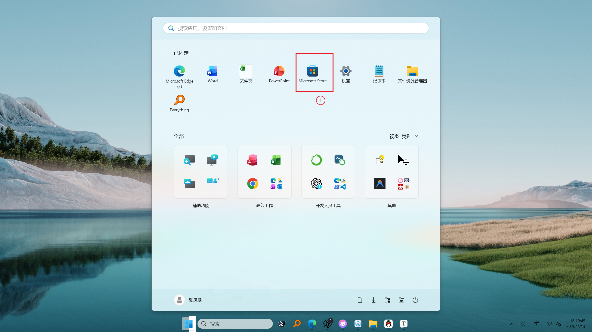

### 2.3 搜索并安装 ChatGPT

在 Microsoft Store 中搜索 `ChatGPT`，确认发布者为 OpenAI，然后点击安装。

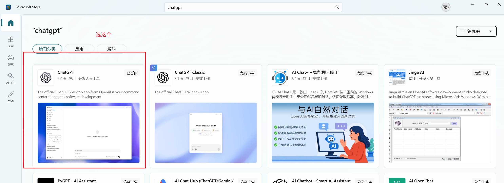

也可以从 [OpenAI 官方下载页面](https://chatgpt.com/download/) 进入对应平台的下载入口。

如果 Microsoft Store 无法打开或无法下载，可以依次检查：

1. Windows 系统和 Microsoft Store 是否已经更新。
2. 当前网络是否能够正常访问 OpenAI 和 Microsoft Store。
3. Microsoft Store 登录账号的地区设置是否可用。
4. 是否能够通过 OpenAI 官方下载页面进入安装入口。
如果使用了代理，分别测试关闭和启用代理后的连接情况，并遵守所在地法律及服务条款。

不要从来源不明的网盘、论坛附件或软件下载站安装所谓的“破解版 Codex”。

## 3. 登录 Codex

安装完成后打开 ChatGPT 桌面应用。对于本地工作，官方支持两种登录方式。

### 3.1 使用 ChatGPT 账号登录（推荐）

对多数用户来说，这是步骤最少的方式。选择使用 ChatGPT 登录后，应用会打开浏览器；按页面提示完成授权，再返回桌面应用。

使用这种方式时，Codex 的可用额度和功能取决于你的 ChatGPT 套餐、工作区权限和管理员设置。

### 3.2 使用 OpenAI API Key

如果没有适用的 ChatGPT 套餐，也可以选择使用 OpenAI Platform 的 API Key。API Key 按实际调用量计费，与 ChatGPT 套餐额度相互独立。

使用 API Key 时需要注意：

- 只从 [OpenAI Platform](https://platform.openai.com/) 创建官方 API Key。
- 不要把 API Key 写进论文、截图、公开仓库或聊天记录。
- 不要把完整 API Key 发给他人。
- 如果怀疑 API Key 已经泄露，应立即在平台中撤销并重新创建。

> [!TIP]
> 第一次使用时，优先选择 ChatGPT 账号直接登录。只有明确需要按 API 调用量计费或进行自动化任务时，再考虑 API Key。

## 4. 使用第三方账号管理工具（可选）

下面介绍的 Cockpit Tools 不是 OpenAI 官方软件，也不是使用 Codex 的必需组件。已经能够通过 ChatGPT 账号或官方 API Key 登录的读者，可以跳过本节。

### 4.1 Cockpit Tools 的用途

Cockpit Tools 是一个第三方 AI 账号和接口管理工具，可以管理多个账号或 OpenAI 兼容接口，并在不同配置之间切换。

项目地址：

[jlcodes99/cockpit-tools](https://github.com/jlcodes99/cockpit-tools)

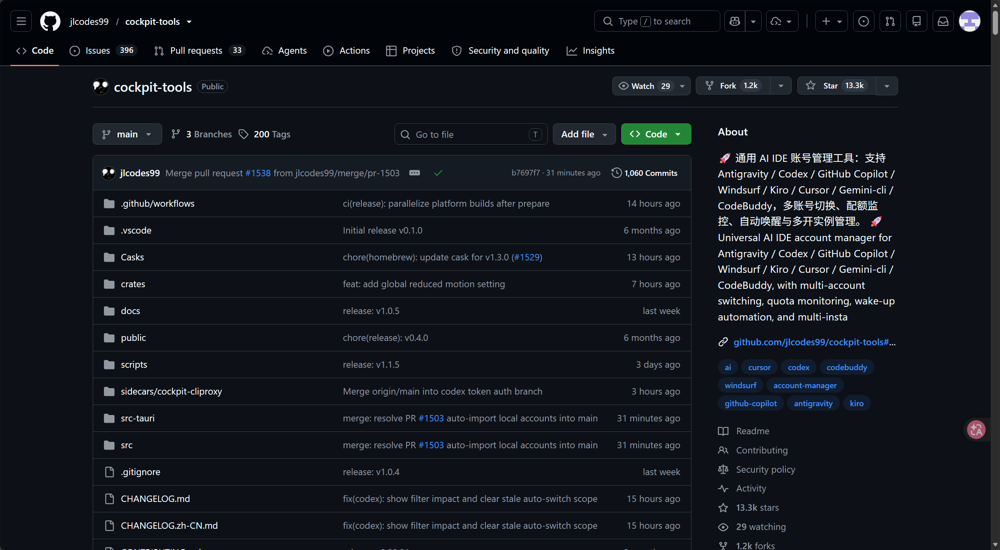

### 4.2 下载 Cockpit Tools

进入 GitHub 项目页面后，找到 `Releases` 区域并点击最新版本。

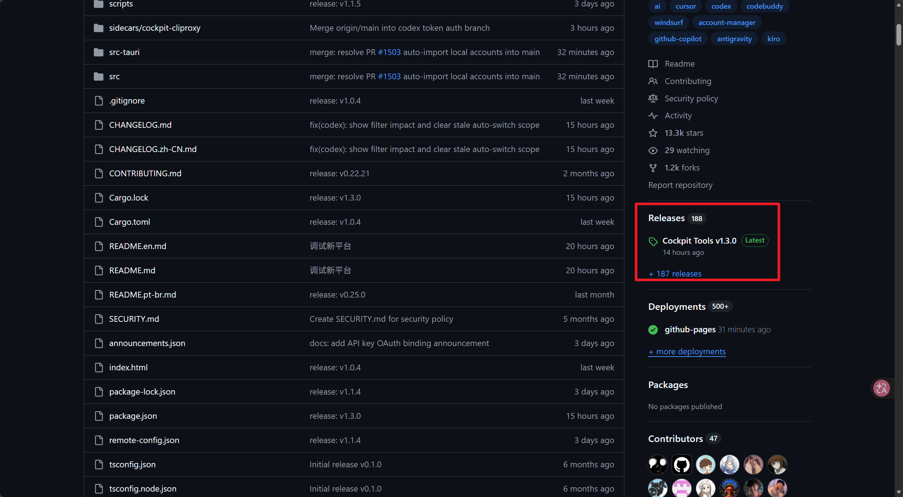

如果下载列表没有完全展开，点击 `Show all assets`。

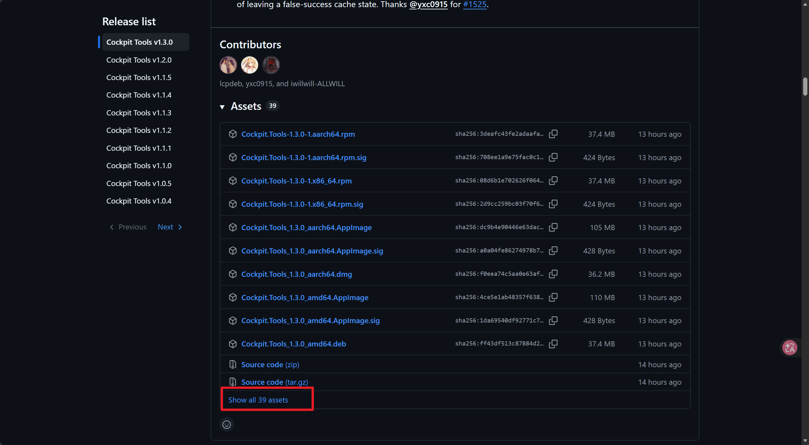

根据自己的 Windows 系统架构选择对应版本。大多数普通 Windows 电脑使用 `x64` 版本；ARM Windows 设备需要选择 `arm64` 版本。

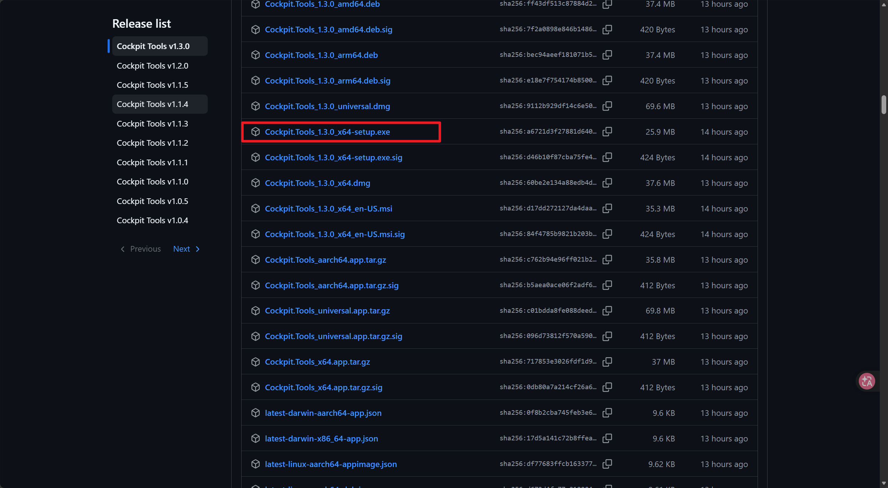

### 4.3 添加 Codex 配置

打开 Cockpit Tools，在产品列表中选择 Codex。

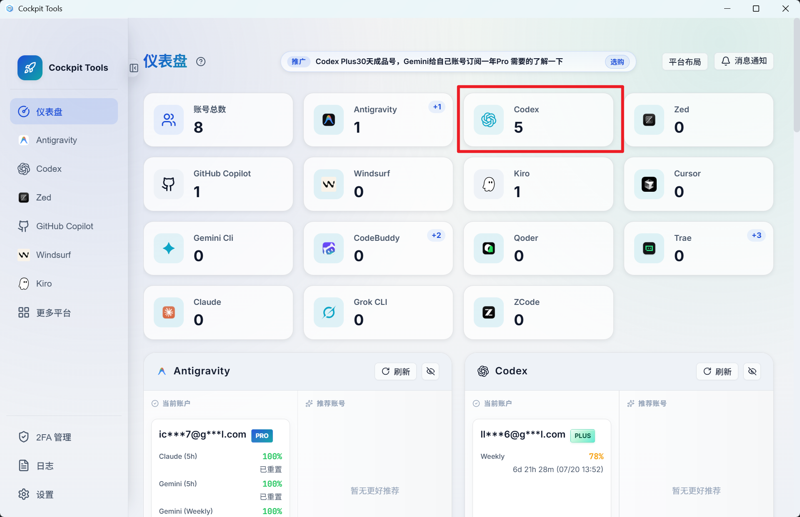

点击加号，添加新的账号或接口配置。

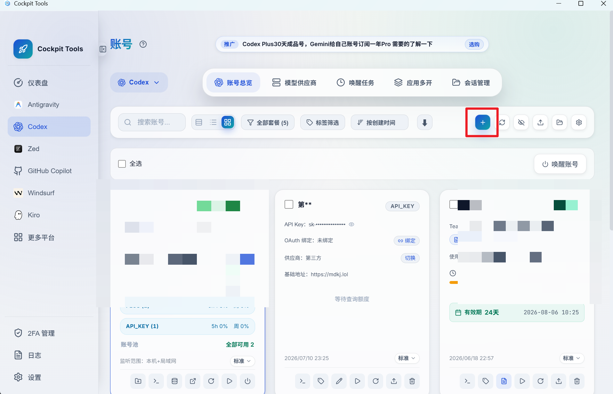

#### 添加官方账号

按照界面顺序选择官方账号登录，然后在浏览器中完成授权。

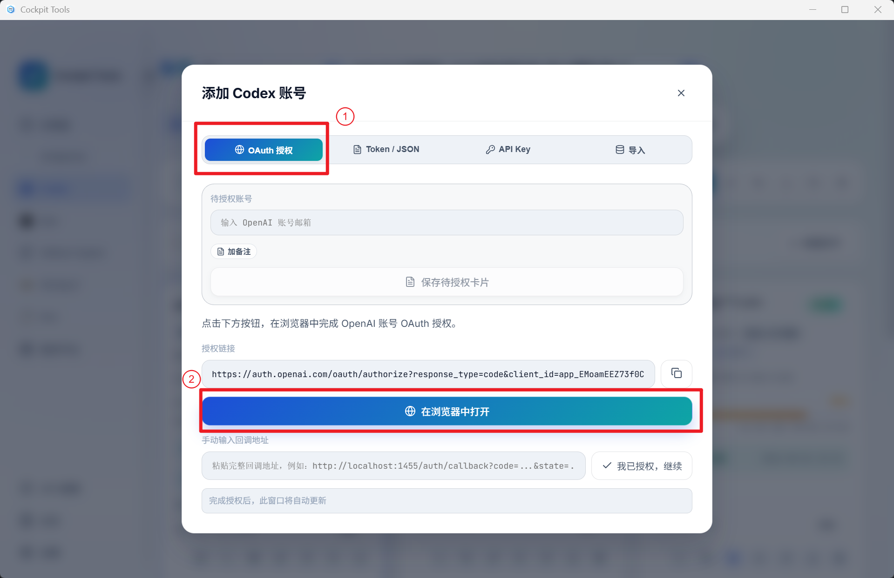

#### 添加第三方 API

如果使用 OpenAI 兼容接口，需要按照服务商提供的说明填写 API 地址和 API Key。

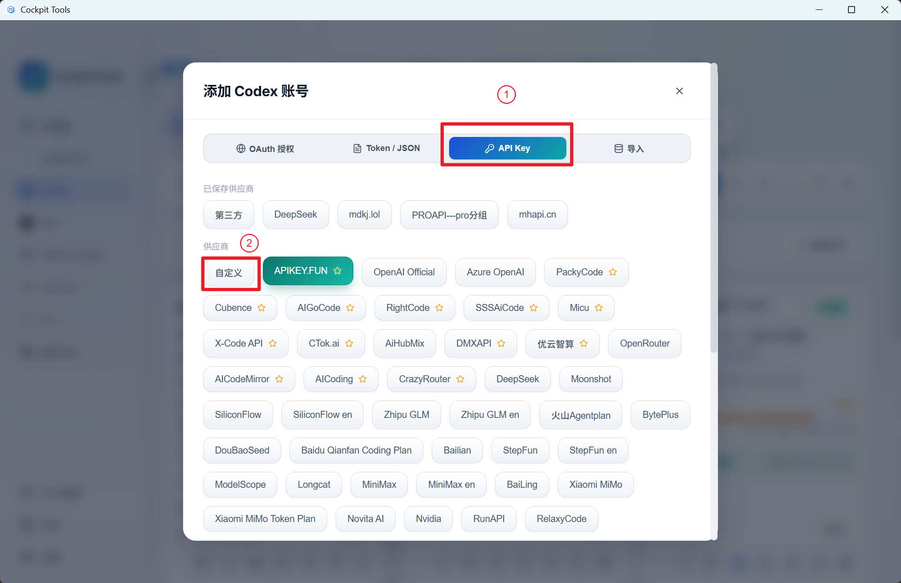

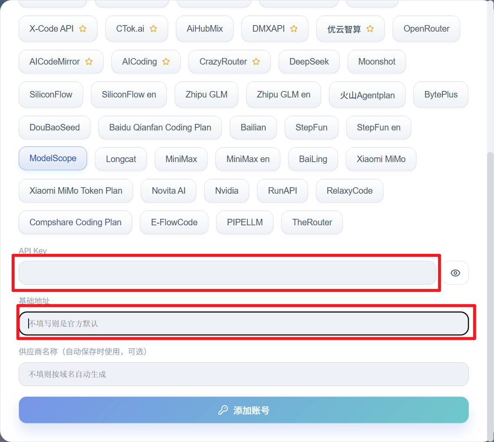

填写时通常需要确认以下信息：

| 配置项 | 含义 |
| --- | --- |
| Base URL | 第三方服务提供的 OpenAI 兼容接口地址 |
| API Key | 第三方服务生成的访问凭据 |
| Model | 服务商实际支持的模型名称 |

第三方中转服务存在隐私、稳定性、计费和数据留存方面的额外风险。未发表论文、实验原始数据、个人信息和涉密材料不应交给无法确认数据政策的服务商处理，也不要一次性预存过多费用。

如需查看第三方服务的公开状态信息，可以参考 [中转站观察网](https://www.kanllm.com/)。该网站同样不是 OpenAI 官方服务，其信息只能作为辅助参考，不能代替服务协议和隐私政策核查。

### 4.4 切换账号或接口

需要切换配置时，在 Cockpit Tools 中选择目标账号或 API 配置，然后点击对应的启动或切换按钮。

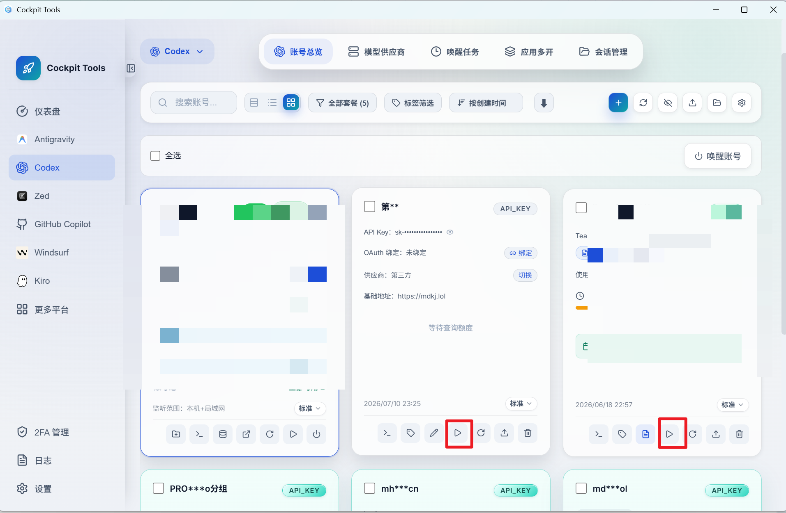

切换后应重新打开 ChatGPT/Codex，并检查当前登录账号、模型和工作区是否正确。

## 5. 切换账号后看不到历史会话

在官方账号、API Key 或第三方接口之间切换后，部分历史会话可能暂时不显示。这不一定表示会话文件已经被删除，也可能是会话所属账号、Provider 元数据或本地索引发生了变化。

处理前建议先执行以下操作：

1. 完全退出 ChatGPT/Codex。
2. 备份本机的 Codex 会话目录。
3. 确认当前登录账号和 Provider 是否正确。
4. 再使用专门的会话恢复工具检查或同步历史记录。

可以参考第三方项目：

[BigPizzaV3/CodexPlusPlus](https://github.com/BigPizzaV3/CodexPlusPlus)

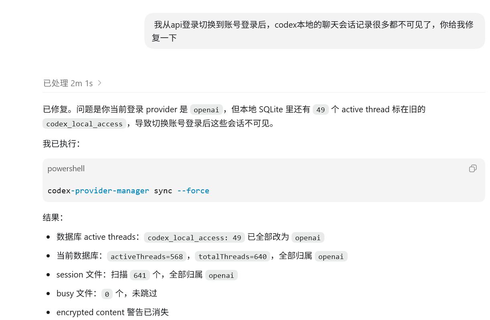

> [!WARNING]
> 会话恢复工具可能会修改 Codex 的本地数据库或会话元数据。操作前必须备份，并避免在 Codex 正在运行时直接修改数据库。不要把“重新安装”作为第一步，以免增加排查难度。

## 6. 安装 Claude Desktop 和 CC Switch

### 6.1 为什么准备备用工具

Codex 更新频率较高，偶尔可能遇到无法发送消息、历史会话暂时不可见、沙盒或代理连接异常等问题。如果这时 Codex 本身无法正常工作，就不能继续依赖 Codex 排查自己的配置。

如果工作不能长时间中断，可以额外准备一个独立运行的 Claude Desktop。它不替代 Codex，只在下面这些场景中备用：

- Codex 无法启动或发送消息时，帮助分析报错。
- Codex 会话或 Provider 配置异常时，协助检查本地文件。
- Codex 修复过程中，提供第二个模型的判断和操作建议。
- 论文或代码修改完成后，作为独立审稿人进行交叉检查。

> [!IMPORTANT]
> 本教程的 Claude 部分**只介绍通过 CC Switch 接入第三方 API**，不展开 Claude 官方账号登录方案。这是本文的使用选择，不代表 CC Switch 或第三方 API 是 Claude Desktop 的唯一使用方式。

### 6.2 安装 Claude Desktop

从 [Claude 官方下载页面](https://claude.ai/download) 下载 Windows 版 Claude Desktop，然后按照安装程序提示完成安装。

安装完成后先不要急着填写账号或接口信息。下一步使用 CC Switch 统一配置第三方 API。

> [!NOTE]
> Anthropic 的官方服务存在支持国家和地区限制。本文不讨论官方账号注册、地区切换或官方订阅，只保留第三方 API 配置路线。

### 6.3 下载 CC Switch

CC Switch 是一个第三方 AI 工具配置管理器，当前支持 Claude Code、Claude Desktop、Codex、Gemini CLI 等应用。它可以通过图形界面添加供应商、填写 API 配置并在不同配置之间切换。

项目地址：

[farion1231/cc-switch](https://github.com/farion1231/cc-switch)

也可以访问 [CC Switch 官方网站](https://ccswitch.io/)。

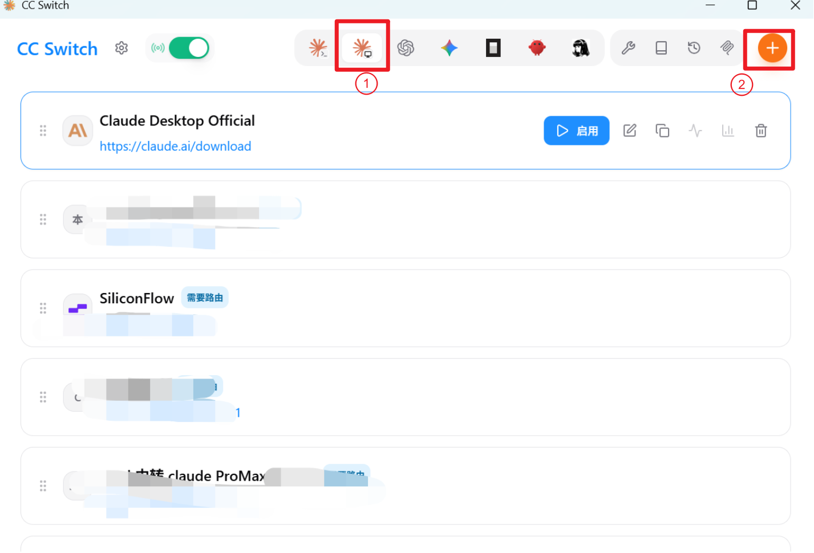

Windows 用户可以进入项目的 [Releases 页面](https://github.com/farion1231/cc-switch/releases/latest)，下载下面任意一种版本：

- `CC-Switch-v版本号-Windows.msi`：普通安装版，适合大多数用户。
- `CC-Switch-v版本号-Windows-Portable.zip`：便携版，解压后运行。

下载前确认文件来自 `farion1231/cc-switch` 官方仓库，不要从来源不明的网盘或软件站下载安装包。

### 6.4 使用 CC Switch 添加 Claude 第三方 API

准备好第三方服务提供的 API 配置后，按下面的顺序操作：

1. 完全退出 Claude Desktop。
2. 打开 CC Switch。
3. 在应用列表中选择 `Claude Desktop`。
4. 点击“添加供应商”或加号按钮。
5. 如果列表中已有对应服务商，优先选择预设；否则创建自定义配置。
6. 按照第三方服务商的接入说明填写 API 地址、API Key 和模型名称。
7. 保存配置并点击“启用”。
8. 重新打开 Claude Desktop，使新配置生效。

常见配置项如下：

| 配置项 | 填写内容 |
| --- | --- |
| 配置名称 | 自己容易识别的名称，例如“Claude 第三方 API” |
| Base URL | 第三方服务提供的 Claude/Anthropic 兼容接口地址 |
| API Key | 第三方服务生成的密钥 |
| Model | 第三方服务实际支持的 Claude 模型名称 |

不同服务商的接口路径和模型名可能不同，不能直接照抄其他平台的配置。应以服务商提供的 Claude Desktop 或 Anthropic 兼容接入说明为准。

### 6.5 验证 Claude 配置

重新打开 Claude Desktop 后，先进行最小测试：

1. 新建一个对话。
2. 输入：`请只回复“Claude 配置成功”。`
3. 检查是否能够正常返回内容。
4. 再发送一段稍长的中文任务，检查是否存在中断、乱码或模型报错。
5. 回到 CC Switch，确认当前启用的确实是刚才添加的供应商。

如果测试失败，按下面的顺序检查：

1. Base URL 是否多写或少写了路径。
2. API Key 是否有效，账户是否有余额。
3. 模型名称是否与服务商文档完全一致。
4. 第三方接口是否要求 Anthropic 兼容格式。
5. 启用配置后是否完全重启了 Claude Desktop。

### 6.6 切换第三方 API

以后需要更换接口时，在 CC Switch 中选择另一个 Claude Desktop 供应商配置并点击“启用”，然后重启 Claude Desktop。

切换前建议先结束正在进行的长任务，避免上下文尚未完成时更换模型或供应商。不同第三方 API 的模型能力、上下文长度和工具支持可能不同，同一个对话在切换后不一定能保持完全一致的行为。

### 6.7 第三方 API 风险

本文只推荐 Claude 走第三方 API，但不代表所有第三方服务都可信。使用前仍需注意：

- 不要向不可信服务上传未发表论文、原始实验数据或涉密材料。
- 不要公开完整 API Key，也不要把密钥写进教程截图。
- 不要一次性预存过多余额。
- 先用少量额度测试模型真实性、响应速度和稳定性。
- 查看服务商的计费规则、隐私政策、数据留存和退款说明。
- 重要任务应保留本地文件和操作记录，不能只依赖云端会话。

## 7. 验证安装是否成功

完成安装和登录后，可以进行一次最简单的测试：

1. 在 ChatGPT 桌面应用中创建一个新任务。
2. 选择一个不包含重要文件的测试文件夹。
3. 输入：`请列出当前文件夹中的文件，但不要修改任何内容。`
4. 检查 Codex 是否能够识别文件夹，并在需要访问文件时显示权限提示。
5. 确认无误后，再打开正式的论文项目。

如果 Codex 能够正常回复、识别项目目录并显示文件列表，就说明基本安装和登录已经完成。

## 8. 常见问题

### 应用安装后找不到 Codex 入口

先确认安装包来自 OpenAI 官方页面或 Microsoft Store，并检查当前账号套餐、工作区权限和管理员策略。完全退出应用后重新登录；仍然看不到入口时，以 OpenAI 官方文档中的可用范围为准。

### 切换接口后仍然使用旧配置

完全退出 ChatGPT/Codex 或 Claude Desktop，包括系统托盘中的后台进程，再在管理工具中确认当前启用项。重新打开应用后，用一个最小测试请求核对模型和供应商。

### 第三方 API 返回认证或模型错误

依次核对 Base URL、API Key、模型名、余额和接口兼容格式。不要凭其他平台的示例猜路径；服务商文档没有明确写出的配置，应先用不含敏感内容的请求测试。

### 历史会话仍然不显示

停止继续切换 Provider，保留现状并备份会话目录。记录当前账号、配置名称和错误表现，再使用会话恢复工具检查。不要在应用运行时直接编辑本地数据库。

## 9. 本章小结

完成本章后，你已经：

- 在 Windows 上安装 ChatGPT 桌面应用。
- 区分 ChatGPT 桌面应用和 Codex 能力。
- 了解 ChatGPT 账号登录和 API Key 登录的区别。
- 了解第三方账号/API 管理工具的用途和风险。
- 安装 Claude Desktop，并使用 CC Switch 接入第三方 API。
- 为 Codex 准备一个能够独立排查问题的备用 AI。
- 学会在正式处理论文前验证文件访问权限。

下一章将介绍如何创建一个结构清晰、便于 Codex 读取和修改的论文项目。

## 参考资料

- [ChatGPT desktop app - OpenAI Developers](https://developers.openai.com/codex/app/)
- [Codex authentication - OpenAI Developers](https://developers.openai.com/codex/auth/)
- [Codex CLI - OpenAI Developers](https://developers.openai.com/codex/cli/)
- [Download Claude - Anthropic](https://claude.ai/download)
- [Anthropic supported countries and regions](https://www.anthropic.com/supported-countries)
- [CC Switch - GitHub](https://github.com/farion1231/cc-switch)
