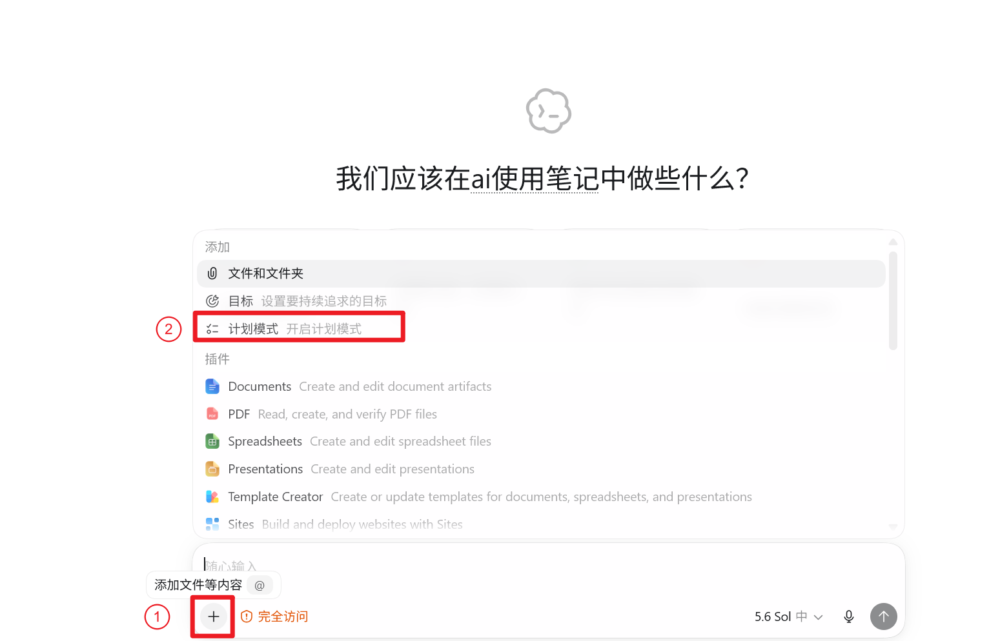
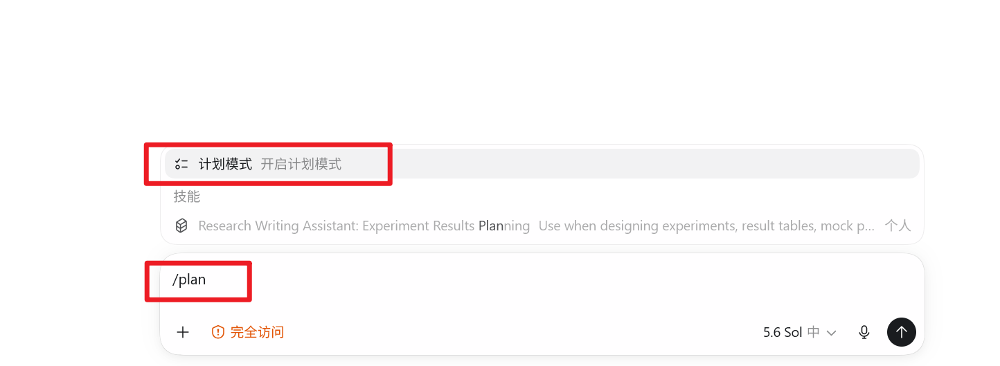
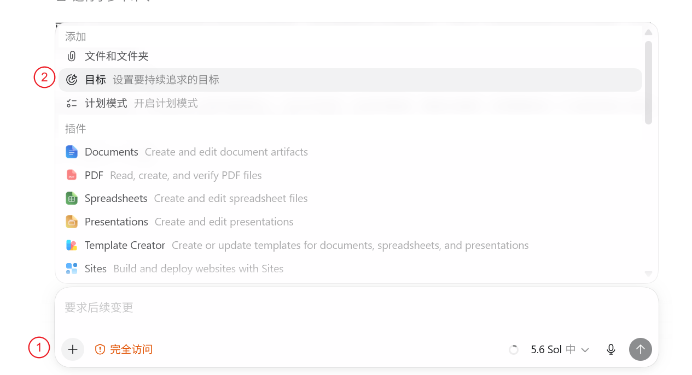
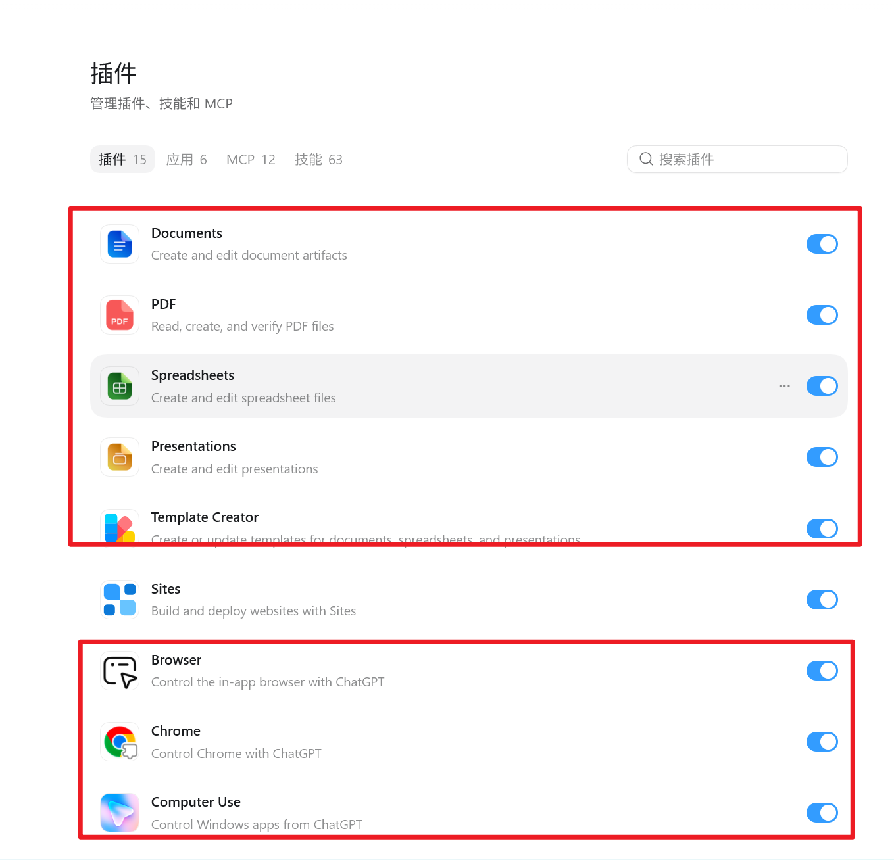
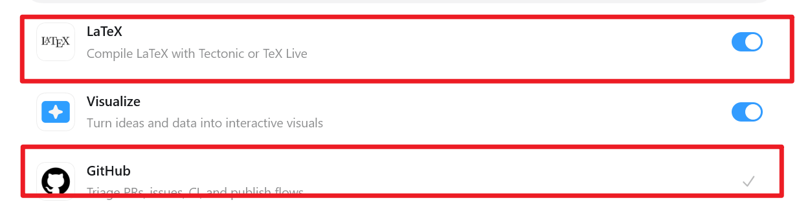

# Codex 进阶使用：从计划到自动化

完成基础安装后，下一步不是记更多命令，而是把 Codex 配置成适合自己工作方式的工具。

## 目录

1. [计划模式](#1-计划模式plan-mode)
2. [目标模式](#2-目标模式goal-mode)
3. [自定义指令](#3-自定义指令)
4. [Skills](#4-skills)
5. [插件](#5-插件)
6. [内置浏览器](#6-内置浏览器)
7. [电脑操控](#7-电脑操控computer-use)

## 1. 计划模式（Plan mode）

计划模式让 Codex 在修改文件前先收集上下文、提出必要问题并整理执行方案。它适合范围较大、路线不明确或改错后返工成本较高的任务。

例如：

- 把一份 Word 论文迁移到期刊 LaTeX 模板。
- 重新组织项目目录，但不能破坏现有编译流程。
- 修改实验方案，需要先比较几种实现路线。
- 排查一个可能涉及多个模块的错误。

对于改一个错别字、重命名一张图片这类简单任务，直接执行通常更快。

### 1.1 从菜单开启

点击输入框左侧的加号，在菜单中选择“计划模式”。



### 1.2 使用 `/plan`

在输入框中输入 `/plan`。也可以在后面直接补上任务，例如：

```text
/plan 请先检查当前论文项目的目录、编译方式和模板依赖，给出迁移到新模板的方案。先不要修改文件。
```



官方文档还提供了 `Shift+Tab` 切换方式。任务已经开始运行时，`/plan` 可能暂时不可用，应先停止当前任务或在下一轮切换。

### 1.3 怎样提出一个好计划

计划请求中最好写清四件事：

| 内容 | 要回答的问题 | 示例 |
| --- | --- | --- |
| 目标 | 最后要得到什么 | 将论文迁移到 IEEE 官方模板 |
| 上下文 | 哪些文件和资料有关 | `main.tex`、模板目录、参考文献库 |
| 限制 | 哪些内容不能动 | 不改实验数据，不删除旧模板 |
| 完成标准 | 怎样算完成 | 编译无错误，引用和图片均正常 |

一个可直接使用的例子：

```text
/plan
目标：把当前论文迁移到新的期刊 LaTeX 模板。
上下文：先读取模板说明、main.tex、references.bib 和 figures 目录。
限制：不修改论文结论和实验数据；保留旧模板作为备份。
完成标准：新模板可以完整编译，交叉引用、图片和参考文献正常。
如果存在多种迁移路线，先比较风险，再让我选择。
```

## 2. 目标模式（Goal mode）

目标模式用于持续追踪一个跨多轮完成的结果。普通对话容易被中途的问题带偏，Goal 会把完成条件保留下来，让 Codex 在后续操作中继续检查任务是否真正完成。

适合的任务包括：

- 完成整篇论文的格式迁移并通过编译。
- 把一个项目的全部测试修复到通过。
- 分批整理几十篇论文，同时保持统一的目录和命名规则。
- 在较长时间内持续改进同一个应用。

### 2.1 从菜单设置目标

点击输入框左侧的加号，选择“目标”，然后写明最终结果和完成条件。



### 2.2 使用 `/goal`

可以直接输入：

```text
/goal 完成论文模板迁移，确保 LaTeX 编译通过，所有引用、图片和公式正常，并保留原始文件。
```

常用命令如下：

| 命令 | 用途 |
| --- | --- |
| `/goal` | 查看当前目标 |
| `/goal 目标内容` | 设置目标 |
| `/goal edit` | 修改目标 |
| `/goal pause` | 暂停目标 |
| `/goal resume` | 继续目标 |
| `/goal clear` | 清除目标 |

### 2.3 Plan 和 Goal 的区别

| 对比项 | Plan | Goal |
| --- | --- | --- |
| 主要作用 | 执行前规划路线 | 跨多轮追踪最终结果 |
| 适用时间 | 开始修改之前 | 长任务的整个执行过程 |
| 是否主动提问 | 通常会先补齐信息 | 重点是保持目标和完成条件 |
| 能否组合使用 | 可以 | 可以 |

复杂任务可以先设置 Goal，再进入 Plan 模式制定第一阶段方案。Goal 管“最终要到哪里”，Plan 管“这一阶段怎么走”。

## 3. 自定义指令

经常重复的要求不必每次都写进提示词。Codex 支持两类常用的持久指令。

### 3.1 全局偏好

适合所有任务的偏好可以写在 **Settings > Personalization** 的自定义指令中，例如默认使用中文、回答保持简洁、修改前先备份重要文档。

不要把某个项目独有的编译命令、目录结构或保密规则放在全局偏好里，否则它们可能影响不相关的任务。

### 3.2 使用 `AGENTS.md` 保存项目规则

`AGENTS.md` 是给 Codex 读取的项目说明。把它放在项目根目录后，Codex 会在开始工作前加载其中的规则。

论文项目可以这样写：

```markdown
# 项目规则

## 文件

- `main.tex` 是主文件。
- 图片放在 `figures/`，不要使用绝对路径。
- 参考文献统一保存在 `references.bib`。

## 修改限制

- 不得编造实验数据、引用或 DOI。
- 不得静默删除原文。
- 修改公式后必须与原始 PDF 对照。

## 验证

- 修改后运行完整 LaTeX 编译。
- 检查缺失引用、重复标签和图片路径。
- 最终报告列出修改文件和未解决警告。
```

Codex 会按“全局目录 → 项目根目录 → 当前子目录”的顺序读取指令。离当前工作目录更近的 `AGENTS.md` 或 `AGENTS.override.md` 优先级更高。

> [!TIP]
> 规则应来自真实问题。Codex 重复犯同一种错误时，再把对应限制写进 `AGENTS.md`。几十条具体规则比几百条空泛要求更有用。


文件夹中 “个性化设置.md”是我自己在用的个性化设置，里面是根据我个人平常遇到的问题改的，懒得自己写的可以直接用我这个


## 4. Skills

Skill 是一套针对特定任务的可复用工作流程。它可以包含操作步骤、参考资料和辅助脚本，让 Codex 处理同类任务时遵循一致方法。

例如：

- `pdf`：读取、生成并检查 PDF。
- `doc`：编辑 Word 文档并检查排版。
- `presentation-skill`：制作和验证 PowerPoint。
- `writing-humanizer-zh`：修改中文表达，减少模板化和 AI 痕迹。

### 4.1 怎样使用

直接在提示词中写明 Skill 名称即可：

```text
使用 writing-humanizer-zh 处理这篇教程，保留技术含义，只修改生硬和重复的表达。
```

部分界面支持通过 `$skill-name` 显式调用，例如：

```text
使用 $pdf 检查这份论文 PDF 的页面溢出、空白页和图片清晰度。
```

如果任务与 Skill 描述高度匹配，Codex 也可能自动调用。重要任务最好明确指定，避免选错流程。

### 4.2 Skill 适合解决什么问题

一个 Skill 最好只负责一类清楚的工作。输入、输出、检查方法都固定的任务最适合做成 Skill，例如“PDF 转 Markdown 后整理图片并生成阅读总结”。临时问题直接写提示词更省事。
一般情况下，要做

## 5. 插件

插件是可安装的能力包，可以包含 Skills、外部应用连接、MCP 工具、浏览器能力或自动化模板。Skill 更像“怎么做”，插件还可以提供“用什么工具和数据做”。

常见例子包括 GitHub、Gmail、Google Drive、Slack、Browser 和 Computer Use。

### 5.1 安装与使用

1. 在 ChatGPT 桌面应用的 Work 或 Codex 中打开 **Plugins**。
2. 搜索目标插件并查看它需要的权限。
3. 点击加号安装；需要外部账号时，按提示完成授权。
4. 安装后新建一个任务，再让 Codex 使用该插件。
5. 需要明确指定时，在输入框中使用 `@插件名`。

新安装的能力通常只会在新任务中加载。继续使用安装前已经打开的旧任务，可能看不到插件。

**推荐安装**（这几个是我自己平时用到的）



## 6. 内置浏览器

内置浏览器让 Codex 和用户在同一个任务中查看网页。它可以打开页面、点击、输入、截图，并验证网页修改后的实际效果。

内置浏览器使用独立的浏览器配置，不会自动继承日常浏览器的标签页和登录状态。如果任务必须使用已有的 Chrome 登录状态，应使用 Chrome 扩展，而不是重新在内置浏览器中登录所有账号。

### 6.1 适合的任务

- 打开本地网页，复现布局或交互问题。
- 检查修改后的页面在桌面端和移动端是否正常。
- 对比公开网页中的最新资料。
- 在页面上添加批注，让 Codex 精确修改某个区域。
- 检查控制台、网络请求和 DOM；这类操作需要开发者模式。

### 6.2 使用方式

安装 Browser 插件后，可以这样写：

```text
使用 @Browser 打开 http://localhost:3000/settings，复现移动端按钮溢出问题。修复后重新打开页面验证，不要修改其他页面。
```

Windows 也可以使用 `Ctrl+Shift+B` 打开内置浏览器。

> [!WARNING]
> 网页内容属于不可信输入。不要因为允许 Codex 打开某个网站，就默认同意页面中的所有操作。提交表单、购买、删除数据和修改权限前，应检查确认提示。

## 7. 电脑操控（Computer Use）

Computer Use 用于操作 Windows 或 macOS 图形界面。它能查看屏幕、移动鼠标、点击和输入，适合无法通过文件、命令行或专用插件完成的任务。

### 7.1 什么时候使用

- 复现只在桌面应用中出现的界面问题。
- 修改必须通过图形界面完成的软件设置。
- 操作没有 API、CLI 或插件的旧软件。
- 验证一个跨多个应用的工作流。

如果目标应用有专用插件或 MCP 工具，应优先使用结构化接口。Computer Use 依赖屏幕状态，窗口位置或弹窗变化都可能影响结果。

### 7.2 Windows 上的注意事项

1. 在 **Plugins > Computer Use** 中安装并启用插件。
2. 在 **Settings > Computer Use** 中检查允许访问的应用。
3. 保持目标程序显示在当前活动桌面。
4. 任务运行时不要同时抢用鼠标和键盘。
5. 对发送消息、删除文件、支付和权限修改等操作逐项确认。

Windows 上的 Computer Use 会占用当前桌面，不能在同一个桌面会话中一边自动操作、一边继续正常使用电脑。离开电脑时，应保持设备解锁、联网，并避免让任务接触密码管理器、私人聊天或其他无关窗口。

示例：

```text
使用 Computer Use 打开目标软件，只检查“导出 PDF”流程是否正常。不要发送邮件，不要覆盖原文件。完成后列出点击过的菜单和生成的文件路径。
```

## 参考资料

- [Codex best practices](https://learn.chatgpt.com/guides/best-practices)
- [Prompting](https://learn.chatgpt.com/docs/prompting)
- [Custom instructions with AGENTS.md](https://learn.chatgpt.com/docs/agent-configuration/agents-md)
- [Build skills](https://learn.chatgpt.com/docs/build-skills)
- [Plugins](https://learn.chatgpt.com/docs/plugins)
- [Browser](https://learn.chatgpt.com/docs/browser)
- [Computer Use](https://learn.chatgpt.com/docs/computer-use)
- [Scheduled tasks](https://learn.chatgpt.com/docs/automations)
- [Using Goals in Codex](https://developers.openai.com/cookbook/examples/codex/using_goals_in_codex/)
