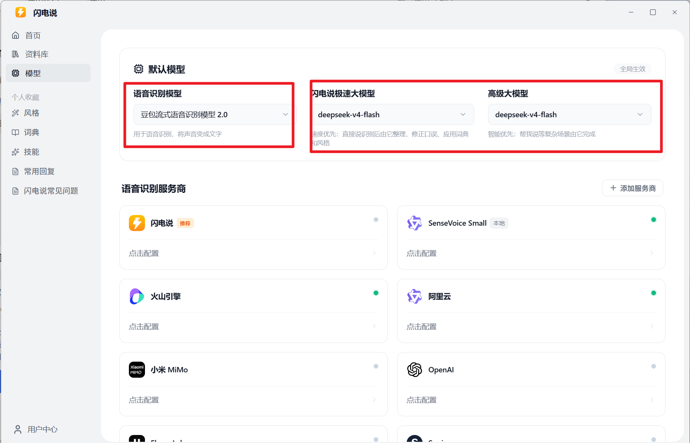
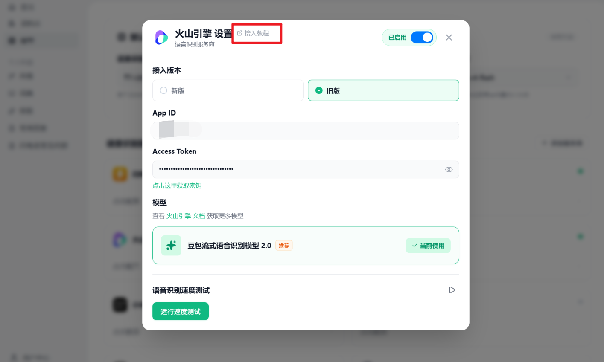
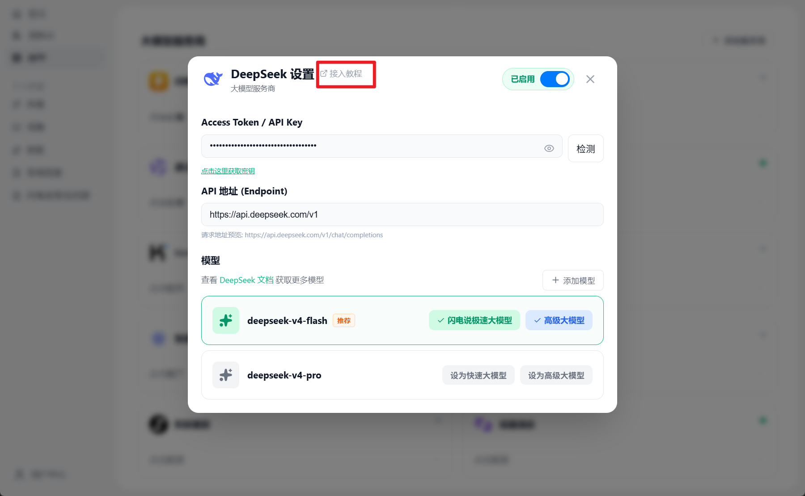
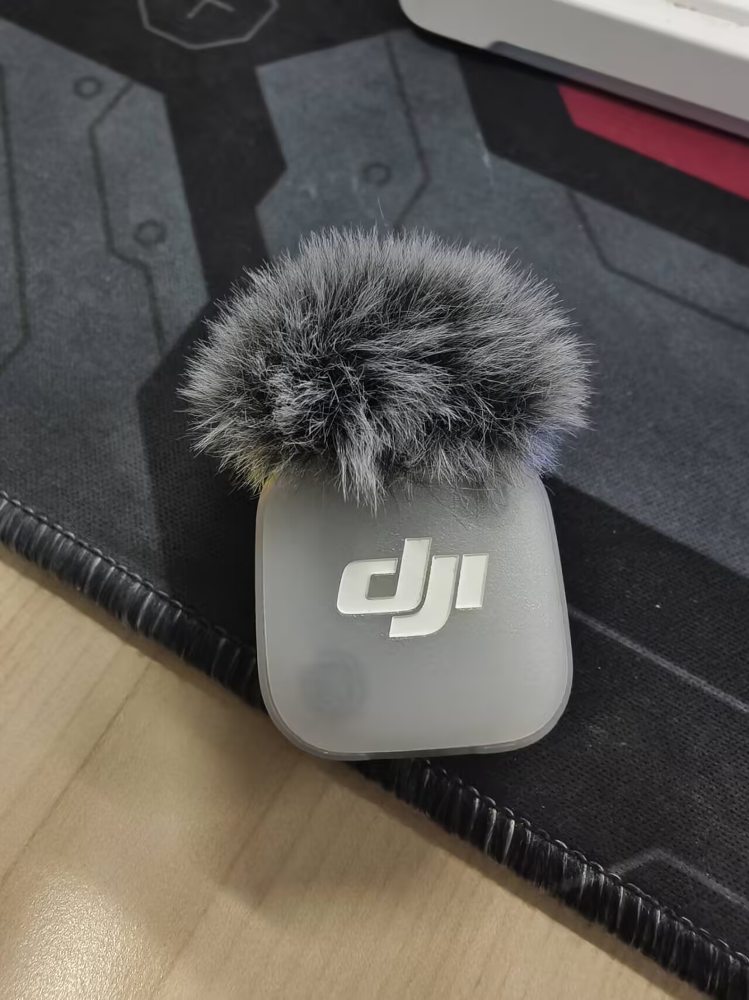
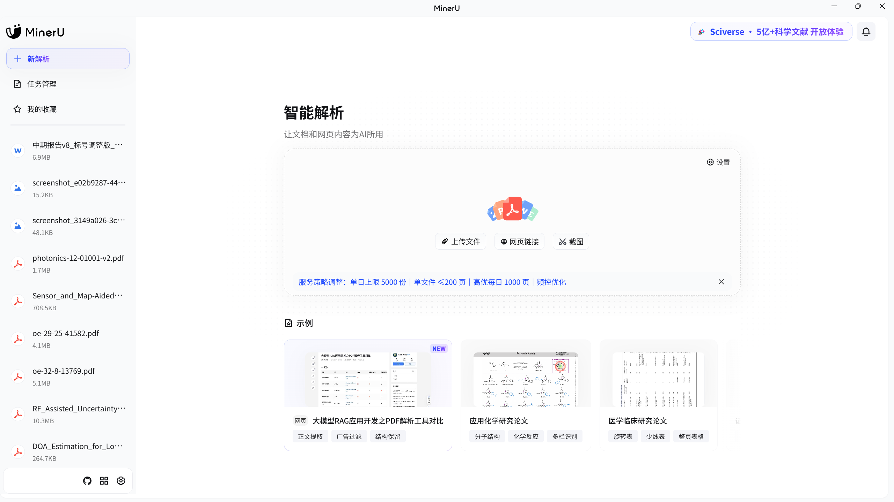
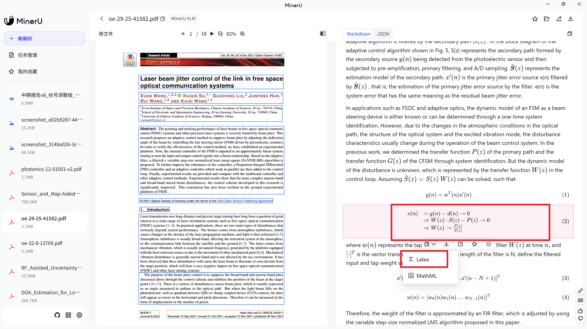
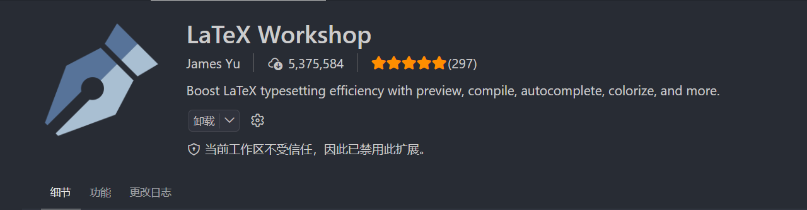

# 好用的 AI 工具推荐

这份清单面向 Windows 用户，整理我在 AI 写作、论文阅读和日常知识管理中用过或认真比较过的工具。重点不是把软件装全，而是给语音输入、文献解析和文档编辑各找一个顺手的工具。

工具的套餐、额度和价格可能随时调整。文中涉及的免费额度和价格，以各工具官网当前显示为准。

## 目录

1. [工具怎么选](#1-工具怎么选)
2. [语音输入工具](#2-语音输入工具)
3. [Markdown 文档工具](#3-markdown-文档工具)
4. [Markdown 编辑器](#4-markdown-编辑器)
5. [LaTeX 论文写作](#5-latex-论文写作)
6. [推荐的组合工作流](#6-推荐的组合工作流)
7. [安全原则](#7-使用工具时的安全原则)
8. [本章小结](#8-本章小结)

## 1. 工具怎么选

不想逐个试，可以先按使用场景缩小范围。

| 使用场景 | 推荐工具 | 主要特点 |
| --- | --- | --- |
| 不想配置，安装后直接语音输入 | Typeless | 自动去除口头语，跨应用输入，使用简单 |
| 希望使用自己的 API 或本地模型 | 闪电说 | 配置灵活，可以自定义语音识别和文本后处理 |
| 把论文 PDF 转成 Markdown | MinerU | 公式、表格和图片解析较完整，支持 MCP |
| 需要自行部署文档解析模型 | PaddleOCR / PaddleOCR-VL | 开源、可定制，适合有一定技术基础的用户 |
| 希望直接编辑和预览 Markdown | Typora | 所见即所得，界面简洁 |
| 希望免费编辑 Markdown | Visual Studio Code | 免费、扩展丰富，适合同时管理代码和论文文件 |

## 2. 语音输入工具

### 2.1 为什么推荐语音输入

向 AI 描述任务时，语音通常比键盘输入更快，也更容易保留完整思路。带有 AI 后处理的语音输入工具，通常还能做这些事：

- 删除“嗯”“然后”“就是说”等口头语。
- 合并重复内容。
- 修正明显的识别错误。
- 添加标点并整理段落。
- 将随口描述改写成结构清楚的 AI 任务。

### 2.2 语音输入处理示例

#### 示例一：让 AI 阅读论文

语音原话：

> 嗯，你帮我看一下这个论文，就是主要看一下它实验那一部分，然后看看它这个实验能不能用到我现在写的这个论文里面。

整理后的输入：

> 请重点阅读这篇论文的实验部分，分析其数据集、评价指标和实验方法，并判断这些实验能否迁移到我当前的论文中。请说明可以直接借鉴的内容、需要调整的部分和潜在风险。

#### 示例二：让 AI 修改文档

语音原话：

> 你把这个文档再改一下，前面的东西别动，主要改后面的实验，然后那个改过的地方给我标出来。

整理后的输入：

> 请只修改文档中的实验章节，不要改动前面的章节。修改后使用醒目的修订标记标出所有新增、删除和替换内容，并提供修改摘要。

语音后处理不只是把声音转成文字。它还能补齐任务对象、修改范围、输出要求和限制条件，让下一步交给 AI 的指令更明确。

### 2.3 Typeless

官网：[Typeless](https://www.typeless.com/)

Typeless 是一款 AI 语音输入工具，可以在 Windows、macOS、iOS 和 Android 上使用。它能够自动去除填充词、重复内容和口语化表达，并将语音整理成较自然的书面文本。


#### 优点

- 安装后即可使用，配置步骤较少。
- 可以在多个应用的输入框中使用。
- 能够自动去除口头语和重复表达。
- 对不熟悉 API 配置的用户比较友好。

#### 局限

- 免费版存在使用额度限制。
- 高峰时段的免费服务可能不够稳定。
- Pro 版本需要订阅。

截至本文核实时，Typeless 免费版提供每周 8,000 词的额度。套餐可能调整，使用前应查看其[官方定价页面](https://www.typeless.com/pricing)。

#### 适合谁

如果你只想获得“下载后直接使用”的语音输入体验，不想研究语音模型和 API，可以优先尝试 Typeless。

### 2.4 闪电说

官网：[闪电说](https://shandianshuo.cn/)

闪电说是一款可配置程度较高的语音输入和沟通 Agent。它既可以直接使用官方提供的基础额度，也可以接入自己的语音识别服务、大模型 API 或本地模型。



#### 优点

- 支持 Windows 和 macOS。
- 可以自定义语音识别模型。
- 可以自定义快速模型和高级模型。
- 支持自己的 API Key 或本地模型。
- 可以通过提示词控制语音转文字后的整理方式。

#### 局限

- 自定义配置比 Typeless 多。
- 使用云端语音识别和大模型 API 时，可能产生额外费用。
- 配置错误时可能出现无法识别、响应慢或模型不可用等问题。

#### 推荐配置流程

1. 安装并启动闪电说。
2. 先使用默认配置完成一次语音输入测试。
3. 根据需要添加语音识别服务。
4. 添加用于文本整理的大模型服务。
5. 编写一段后处理提示词。
6. 分别测试安静环境、普通说话和小声说话的识别效果。

### 2.5 配置语音识别服务

语音识别服务负责把声音转换成原始文字。实际选择时，应重点比较识别准确率、延迟、价格、专有名词识别和隐私政策。

我用过火山引擎的豆包语音识别服务，在自己的中文听写场景中表现不错。这只是个人测试结果，不同口音、麦克风和网络环境可能得到不同结果。赠送额度和计费规则以闪电说接入教程及火山引擎控制台为准。



配置完成后，建议用下面三类内容测试：

1. 一段普通中文口语。
2. 一段包含论文术语、英文缩写和数字的内容。
3. 一段包含较长停顿和重复表达的内容。

只测试一句“你好”不能判断一个语音识别服务是否适合论文写作。

### 2.6 配置文本后处理模型

文本后处理模型负责整理语音识别得到的原始文字。如果不配置后处理模型，工具通常只会输出接近原始语音的逐字稿。



这项任务通常不需要最强的推理模型。选择服务商当前提供的低延迟、低成本文本模型即可，实际模型名以控制台和 API 文档为准。

DeepSeek API 平台：[platform.deepseek.com](https://platform.deepseek.com/)

下面是我现在使用的语音后处理提示词：

```text
清理规则：
* 去除口头禅和填充词（嗯、啊、那个、就是、然后、反正、基本上），除非它们确实有表达意义
* 修正语法、拼写和标点错误
* 将过长的句子用适当的标点断开
* 去除重复表述、口吃和不完整的句子片段
* 纠正明显的语音识别错误
* 保持说话者原有的语气、风格和用词习惯
* 完整保留专业术语、专有名词、人名和行业用语
* 保持原有的正式/非正式程度（口语化的保持口语化，正式的保持正式）
自我纠正：
当用户口头纠正自己时，只保留纠正后的版本：
* "我需要给小王打电话……不对，是小李" → "我需要给小李打电话"
* "会议在周二……抱歉，是周三下午3点" → "会议在周三下午3点"
* "发给市场部……算了，发给销售部" → "发给销售部"
* "我们需要五份……不，十份报告" → "我们需要十份报告"
需要识别的纠正短语："不对"、"抱歉"、"我是说"、"其实不是"、"算了"、"不不不"、"换个说法"、"更正一下"、"我本来想说的是"、"或者说"
注意："其实"常用于强调而非纠正。"其实，我觉得这个主意很好"不是纠正——保留原文。只有当"其实"后面的内容明确替换了前面所说的内容时，才视为纠正。
口头标点与格式命令：
用户可能会口头说出标点符号或格式指令，将它们转换为对应的符号：
* "句号" → 。
* "逗号" → ，
* "问号" → ？
* "感叹号" → ！
* "冒号" → ：
* "分号" → ；
* "破折号" → ——
* "省略号" → ……
* "换行" → （插入换行）
* "另起一段" / "新段落" → （插入段落分隔）
* "引号" / "左引号" / "右引号" → ""
* "括号" / "左括号" / "右括号" → （）
* "方括号" / "左方括号" / "右方括号" → 【】
根据上下文区分命令和字面提及。"我需要鸡蛋逗号牛奶逗号还有面包" → "我需要鸡蛋，牛奶，还有面包。"但"我们在语文课上讨论了逗号的用法"是关于逗号的内容——保持原文。
数字、日期与货币：
将口头说出的数字、日期、时间和货币转换为标准书写格式：
* 日期："二零二六年一月十五日" → "2026年1月15日"
* 时间："下午五点半" → "下午5:30"、"中午" → "中午"
* 货币："三百块" → "300元"、"两百三十四块五" → "234.50元"
* 百分比："百分之二十五" → "25%"
* 电话号码："一三八一二三四五六七八" → "138-1234-5678"
* 大数："两百五十万" → "250万"
* 度量："一米七五" → "1.75米"
根据上下文判断：小的口语化数字（一到十）在日常表达中可以保留汉字形式（"我有两只猫"）。较大的数字、金额、日期、时间和技术数值应使用阿拉伯数字。
智能格式化：
根据内容上下文智能应用格式。使输出易于阅读且结构清晰：
项目符号——用于用户列举事项时：
* 购物清单（"我需要买鸡蛋、牛奶、面包……"）
* 待办事项（"我要记得给小王打电话、发报告、订机票……"）
* 多个要点或想法（"有几件事……第一……另外……最后……"）
* 功能、优点或选项的列举
编号列表——用于顺序或步骤很重要时：
* 分步操作说明（"首先做这个，然后做那个，最后……"）
* 排序或优先级
* 流程或操作步骤
段落分隔——在以下情况之间添加换行：
* 不同的主题或想法
* 思路的自然转换
* 较长内容的不同部分
邮件格式——听写邮件时：
* 称呼单独一行
* 正文段落之间用空行分隔
* 结束语和署名分别单独成行
社交媒体/帖子——听写微信朋友圈、微博等内容时：
* 拆分为易读的段
* 将开头/引言与正文分开
* 使用换行增强可读性和节奏感
不要过度格式化。如果用户只是在听写一两句话，直接输出简洁的文本即可。只有在格式化确实能提升可读性且符合内容类型时，才应用格式。

```

> [!IMPORTANT]
> 在任何软件中填写 API Key 时，都不要截图公开完整密钥。未发表论文、实验数据和个人信息不应发送给无法确认数据政策的第三方服务。

### 2.7 麦克风怎么选

语音输入效果不只取决于模型，也取决于麦克风与嘴部的距离。在实验室、办公室或宿舍中，如果不方便大声说话，可以使用靠近嘴部的小型麦克风。

选择时建议关注：

- 是否能稳定连接电脑。
- 麦克风能否靠近嘴部放置。
- 小声说话时是否仍能清楚收音。
- 开始录音时是否容易漏掉开头内容。
- 是否存在明显底噪或断音。

蓝牙设备可能受连接状态、编码和延迟影响。需要按下快捷键后立即说话时，有线连接或带 USB 接收器的 2.4 GHz 无线麦克风通常更省心，但仍应以实际测试结果为准。

#### 普通有线麦克风

我最开始使用的是一款普通有线麦克风。它价格不高，但因为能够靠近嘴部，实际识别效果比距离较远的电脑内置麦克风更稳定。


这说明语音输入不一定需要昂贵设备。先调整麦克风位置和输入音量，往往比直接购买新设备更有效。

#### DJI Mic Mini

后来我换成了 DJI Mic Mini。它体积较小，可以夹在衣服上，并通过接收器连接电脑，适合不想一直手持麦克风的用户。



它的优势是轻便、收音位置稳定，也能兼顾视频录制；缺点是整套设备成本高于普通有线麦克风。购买前应确认套装是否包含电脑需要的接收器。

## 3. Markdown 文档工具

### 3.1 为什么推荐 Markdown

AI 很适合读取和生成 Markdown。与复杂的 Word 排版相比，Markdown 结构简单，标题、列表、表格、图片和公式都可以使用纯文本表示。

对这套工作流来说，Markdown 有几个直接好处：

- 文件体积小，便于 AI 读取和修改。
- 标题层级清楚，适合拆分长文档。
- 支持图片、表格、代码块和数学公式。
- 适合使用 Git 记录修改历史。
- 可以转换为 Word、LaTeX、HTML 和 PDF。
- 适合保存论文阅读笔记和本地知识库。

不过，学校作业、正式论文和项目报告通常仍要求 Word、LaTeX 或 PDF。我的做法是平时用 Markdown 积累内容，交付前再转换成指定格式。

### 3.2 MinerU：把论文转成 Markdown

官网：[MinerU](https://mineru.net/)

MinerU 是一个开源智能文档解析项目和在线平台，支持解析 PDF、Word、PPT、Excel、图片和网页 URL，并输出 Markdown、JSON、LaTeX 等结构化结果。



用它处理论文时，比较实用的能力包括：

- 尽可能保留标题层级和正文结构。
- 提取论文中的图片和表格。
- 将数学公式转换为 LaTeX。
- 便于 AI 后续检索、总结和引用原文。
- 支持 MCP，可接入自动化工作流。



在线版的免费额度、文件数量和单文件页数限制会随套餐调整，因此不在笔记中写死。批量处理前，应先查看 MinerU 当前页面和账户额度。

#### 推荐使用流程

1. 从知网、Google Scholar、IEEE Xplore 等来源获取合法的论文 PDF。
2. 使用 MinerU 将 PDF 转换为 Markdown。
3. 检查标题层级、公式、表格和图片链接。
4. 将 PDF、Markdown 和图片目录放在同一个论文文件夹中。
5. 让 AI 基于 Markdown 生成阅读总结。
6. 在使用论文观点前，回到 PDF 原文核对页码和上下文。

> [!WARNING]
> PDF 转 Markdown 不是无损转换。双栏排版、跨页表格、脚注和复杂公式可能解析错误，不能未经核对就直接用于论文引用。

#### 在线解析还是本地部署

普通公开论文可以使用在线解析。涉及未公开数据、个人信息或涉密材料时，应先核查数据政策，必要时采用本地部署，并确保模型、日志和缓存不会把文件上传到外部服务。

### 3.3 PaddleOCR / PaddleOCR-VL

[飞桨 AI Studio](https://aistudio.baidu.com/overview) 是人工智能学习、模型和算力平台，本身不能简单等同于“一键 PDF 转 Markdown 软件”。实际进行文档解析时，通常使用飞桨生态中的 PaddleOCR、PP-Structure 或 PaddleOCR-VL 等项目。

这类方案的优点是开源、可定制，适合本地部署和二次开发；缺点是环境配置、模型下载和批量处理脚本比 MinerU 在线版复杂。

建议按照以下原则选择：

| 情况 | 建议 |
| --- | --- |
| 第一次把论文转成 Markdown | 先使用 MinerU 在线版或客户端 |
| MinerU 对某篇论文解析不理想 | 使用 PaddleOCR 系列进行对照解析 |
| 文件不能上传到第三方服务器 | 评估本地部署 MinerU 或 PaddleOCR |
| 需要批量解析并接入程序 | 使用 API、MCP 或本地脚本 |

不同解析工具的效果与论文版式有关，不能只根据一篇测试文档断言哪个工具“绝对更好”。

## 4. Markdown 编辑器

### 4.1 Typora

官网：[Typora](https://typora.io/)

Typora 是一款所见即所得的 Markdown 编辑器。它会直接在编辑区域中渲染标题、表格、图片和公式，不需要长期在源码与预览窗口之间切换。

#### 优点

- 安装后即可使用，配置较少。
- 支持图片、表格、任务列表、数学公式和流程图。
- 实时预览，适合不熟悉 Markdown 语法的用户。
- 界面简洁，适合长时间写笔记。

#### 局限

- 正式版需要购买许可证。
- 插件和深度定制能力不如 VS Code。

Typora 官方目前提供 15 天试用，许可证采用一次性购买方式，可由同一用户同时激活最多 3 台设备。价格和税费以 [Typora 官方商店](https://store.typora.io/) 为准。

### 4.2 Visual Studio Code

Visual Studio Code 本身支持 Markdown 编辑和预览，也可以安装 Markdown All in One 等扩展增强目录、快捷键和格式化功能。

官方教程：[Markdown and Visual Studio Code](https://code.visualstudio.com/docs/languages/markdown)

#### 优点

- 免费使用。
- 适合同时管理 Markdown、LaTeX、Python 和 MATLAB 文件。
- 支持项目目录、全文搜索、Git 和丰富的扩展。
- 可以使用拆分窗口同时查看源码和渲染效果。

#### 局限

- 默认以 Markdown 源码编辑为主，不是完整的所见即所得体验。
- 对第一次接触 Markdown 的用户来说，界面比 Typora 复杂。

如果主要需求是写个人笔记，可以选 Typora；如果论文项目中还有代码、数据和 Git，VS Code 通常更合适。两者也可以同时使用，但不要同时编辑同一个文件，以免覆盖未保存的内容。

## 5. LaTeX 论文写作

### 5.1 为什么推荐使用 LaTeX

如果期刊或会议同时接受 Word 和 LaTeX，并且官方提供了 LaTeX 模板，可以优先考虑使用 LaTeX 写作。

LaTeX 的优势主要体现在：

- 章节、公式、图表和参考文献可以自动编号。
- 交叉引用、目录和引用格式更容易保持一致。
- 官方模板通常已经定义好字体、页边距和版式。
- 源文件是纯文本，便于 Git 管理和 AI 修改。
- 数学公式和代码内容比在 Word 中更容易批量处理。
- 可以通过编译日志定位缺失引用、图片和语法错误。

不过，“能够成功编译”不等于“一定符合投稿要求”。提交前仍需对照官方模板说明检查页数、匿名要求、图片分辨率、字体嵌入、参考文献格式和补充材料。

### 5.2 使用官方模板写作

开始一个 LaTeX 论文项目时，可以按下面的顺序操作：

1. 从期刊、会议或学校官网下载最新模板。
2. 保留模板中的 `.cls`、`.sty`、`.bst` 和示例文件。
3. 先编译原始模板，确认本地环境可以正常工作。
4. 复制一份模板作为工作版本，不直接破坏原始模板。
5. 分章节替换示例内容。
6. 将参考文献整理到 `.bib` 文件中。
7. 每完成一部分就重新编译并检查警告。

不要只复制模板中的 `main.tex`。部分模板依赖同目录下的类文件、样式文件、参考文献样式和图片资源，漏掉这些文件会导致编译失败或格式异常。

### 5.3 从 Markdown 或 Word 转为 LaTeX

前期写作时，可以先在 Markdown 或 Word 中整理思路，再让 AI 把内容迁移到官方 LaTeX 模板中。这样既能降低初期写作门槛，也方便后期统一格式。

建议分阶段转换：

1. 先迁移标题和正文，不立即处理所有格式细节。
2. 再转换公式、表格和图片。
3. 将正文中的引用替换为 `\cite{}` 等 LaTeX 引用命令。
4. 检查标签和交叉引用是否唯一。
5. 执行完整编译流程并检查日志。
6. 将生成的 PDF 与原文逐页对照。

MinerU 输出的 LaTeX 公式通常可以作为转换起点，但复杂公式仍可能识别错误，必须回到论文 PDF 或公式来源核对。

### 5.4 使用 TikZ 绘制简单示意图

对于主要由线条、箭头、节点和文字组成的模型示意图，可以让 AI 生成 TikZ 代码。TikZ 图具有矢量、文字清晰、样式统一和便于版本管理等优点。

适合 TikZ 的内容包括：

- 简单系统框图。
- 算法流程图。
- 信号传输关系图。
- 坐标系和几何关系图。
- 网络节点连接图。

结构非常复杂、需要频繁拖动调整的图，使用 draw.io、Inkscape 或 PowerPoint 形状通常更高效。AI 生成 TikZ 后，还要检查节点是否重叠、字号是否可读、箭头方向是否正确，以及黑白打印时能否区分。

### 5.5 保存可编辑的仿真图

论文中的仿真图不要只保存 PNG。后续修改中英文标题、横纵坐标、图例、颜色和字号时，可编辑源文件非常重要。

推荐同时保存：

| 绘图环境 | 建议保留的文件 |
| --- | --- |
| MATLAB | 绘图脚本、原始数据、`.fig`、`.pdf` 或 `.svg`、`.png` |
| Python / Matplotlib | 绘图脚本、原始数据、Figure 对象 `.pkl`、`.svg`、`.pdf`、`.png` |
| draw.io | `.drawio` 源文件、`.svg` 或 `.pdf`、预览图 |
| TikZ | `.tex` 或独立 TikZ 源文件、编译后的 `.pdf` |

同一张图的源文件、矢量图、展示图和数据文件最好使用相同的基础文件名，并放在同一目录中。这样 Codex 才能根据论文中的图片快速追溯到绘图代码和数据来源。

### 5.6 Overleaf

官网：[Overleaf](https://www.overleaf.com/)

Overleaf 是浏览器中的在线 LaTeX 编辑器，不需要在本机安装 TeX 环境。它适合刚接触 LaTeX、需要快速编译模板或多人协作的用户。

#### 优点

- 打开浏览器即可使用。
- 模板资源丰富。
- 可以在线编译和预览 PDF。
- 适合导师、同学共同修改。
- 支持版本历史和评论等协作功能。

#### 局限

- 免费套餐在协作者数量、编译时间和高级功能方面存在限制。
- 项目文件主要保存在云端，涉密材料需要谨慎评估。
- 网络不稳定时使用体验会受到影响。
- Codex 处理本地文件时，不如本地 LaTeX 项目直接。

Overleaf 当前提供受限的免费套餐，也提供付费套餐，不能简单概括为“只能付费”。具体权益以[官方套餐页面](https://www.overleaf.com/user/subscription/plans)为准。

### 5.7 VS Code + LaTeX Workshop（推荐）

如果希望把论文源码、图片、参考文献、实验代码和数据都保存在本地，可以使用 VS Code 配合 LaTeX Workshop。

> [!IMPORTANT]
> LaTeX Workshop 只是 VS Code 扩展，本身不包含完整的 LaTeX 编译器。Windows 用户还需要先安装 TeX Live 或 MiKTeX。

推荐安装顺序：

1. 安装 [TeX Live 或 MiKTeX](https://www.latex-project.org/get/)。
2. 安装 Visual Studio Code。
3. 在扩展商店安装 [LaTeX Workshop](https://marketplace.visualstudio.com/items?itemName=James-Yu.latex-workshop)。
4. 完全重启 VS Code，让环境变量生效。
5. 使用 VS Code 打开完整的论文文件夹，而不是只打开一个 `.tex` 文件。
6. 打开主文件并执行一次编译。
7. 检查生成的 PDF 和 LaTeX Workshop 日志。



本地项目的优势是 Codex 可以直接读取和修改 `.tex`、`.bib`、图片、代码和数据文件，也可以运行编译命令并根据日志继续修复问题。

### 5.8 Overleaf 和 VS Code 怎么选

| 情况 | 推荐方式 |
| --- | --- |
| 第一次接触 LaTeX，不想配置环境 | Overleaf |
| 需要与导师或同学在线协作 | Overleaf |
| 希望让 Codex 直接修改整个项目 | VS Code + LaTeX Workshop |
| 论文包含大量本地代码和实验数据 | VS Code + LaTeX Workshop |
| 文件不能上传到云端 | 本地 TeX Live/MiKTeX + VS Code |

两种方式可以结合使用，但应明确哪个版本是主版本，避免 Overleaf 和本地文件分别修改后产生冲突。

## 6. 推荐的组合工作流

下面是一套适合论文学习和 AI 协作的基础流程：

1. 使用 Typeless 或闪电说快速描述任务。
2. 让语音后处理模型删除口头语并整理任务要求。
3. 将整理后的任务交给 Codex。
4. 使用 MinerU 将论文 PDF 转成 Markdown。
5. 将 PDF、Markdown、图片和阅读总结放进同一个论文目录。
6. 使用 Typora 阅读和修改笔记，或使用 VS Code 管理整个论文项目。
7. 需要正式提交时，再将 Markdown 转换为 Word、LaTeX 或 PDF。

这套流程只要求每个工具负责一个明确环节：

> 语音输入捕捉想法，AI 后处理整理任务，MinerU 解析文献，Markdown 保存内容，Codex 读取材料并执行任务。

## 7. 使用工具时的安全原则

- 不要在截图、教程或公开仓库中暴露 API Key。
- 不要把未发表论文和实验原始数据随意上传到第三方平台。
- 使用云端解析前先查看隐私政策和数据留存说明。
- 软件和模型应从官网、官方商店或项目官方仓库下载。
- 免费额度、模型名称和价格应以官网当前页面为准。
- AI 生成的论文总结、公式和引用必须回到原文核查。
- LaTeX 编译成功后仍要人工检查版式和投稿要求。
- 仿真图必须保留绘图代码、原始数据和可编辑源文件。

## 8. 本章小结

第一次搭建这套工作流，可以先从下面四项开始：

- 语音输入：Typeless。
- PDF 转 Markdown：MinerU。
- Markdown 编辑：Typora。
- 项目管理和 AI 协作：VS Code + Codex。

希望减少订阅费用、愿意自己配置 API 时，可以把 Typeless 换成闪电说；需要本地部署文档解析时，可以进一步学习 MinerU 或 PaddleOCR 系列工具。
