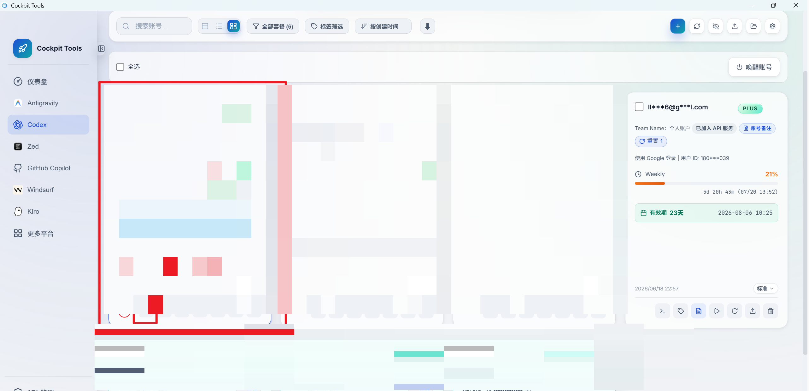
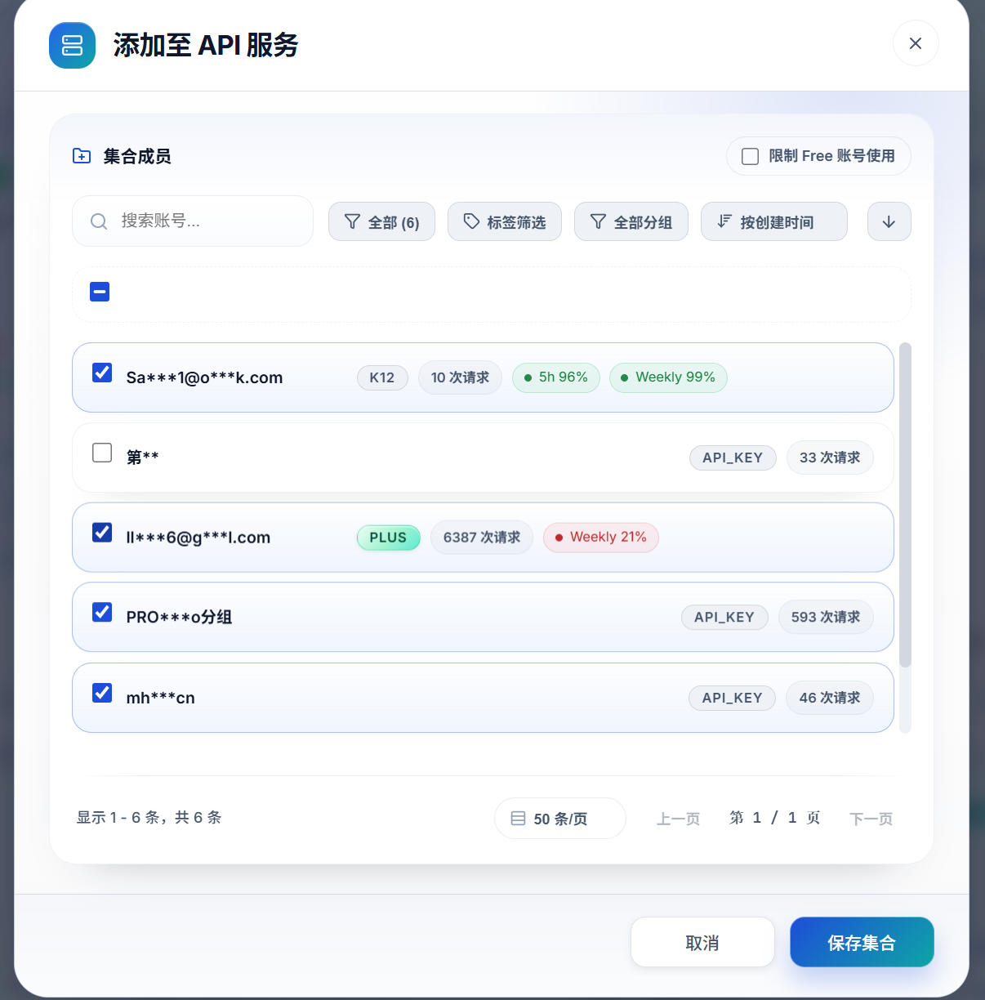
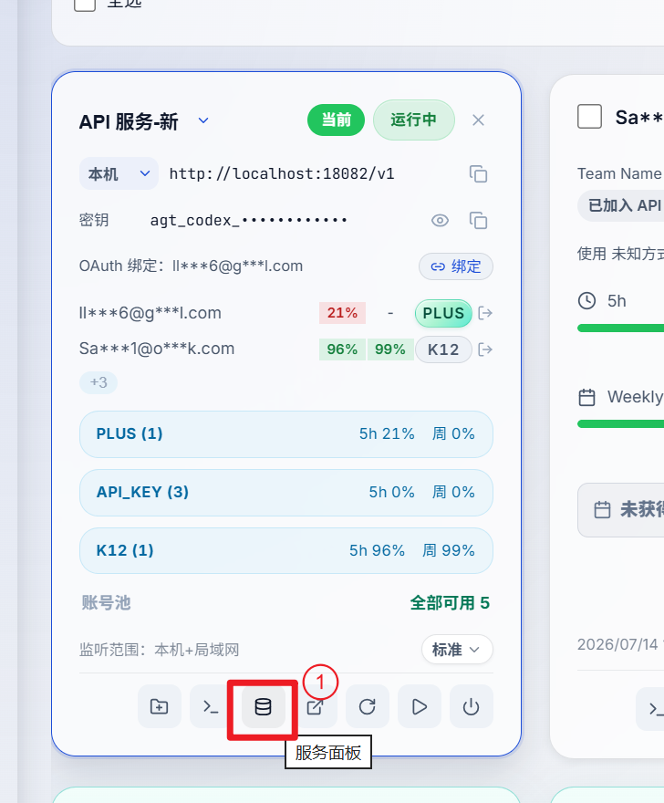
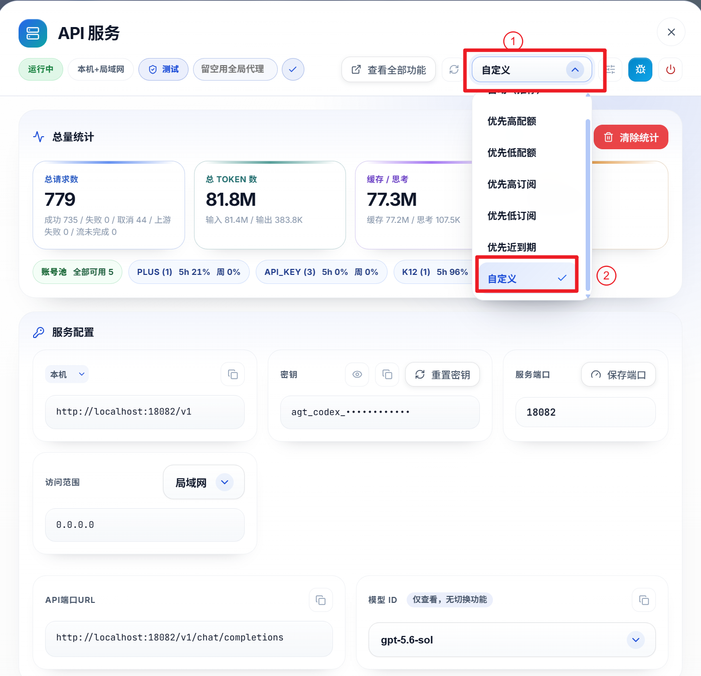
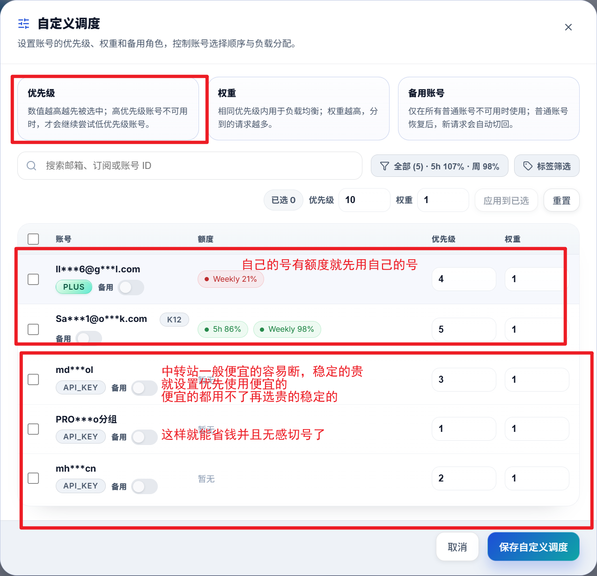

这个是使用cockpit tool来实现多个账号/api链接自动切换的
要是同时使用多个不同价格的api中转站时，这样操作可以省点钱，并且做到无缝切换
也可以把api中转站设置为账号额度用完后的备用

1.在左上角这里添加多个api服务

2.把能用的号都放进去，然后保存

3.进服务面板，调整api调度规则

4.设置调度规则
只调优先级那里就行
自己要是有号，就放最前面（自己号的额度不用就过期了）
中转站的话，就按价格来排序
他这个是优先级越高，越先用

就把那些便宜但不稳定的中转站优先级排高
稳定但贵的优先级调低了，做兜底用

这样就又省钱又稳定了

